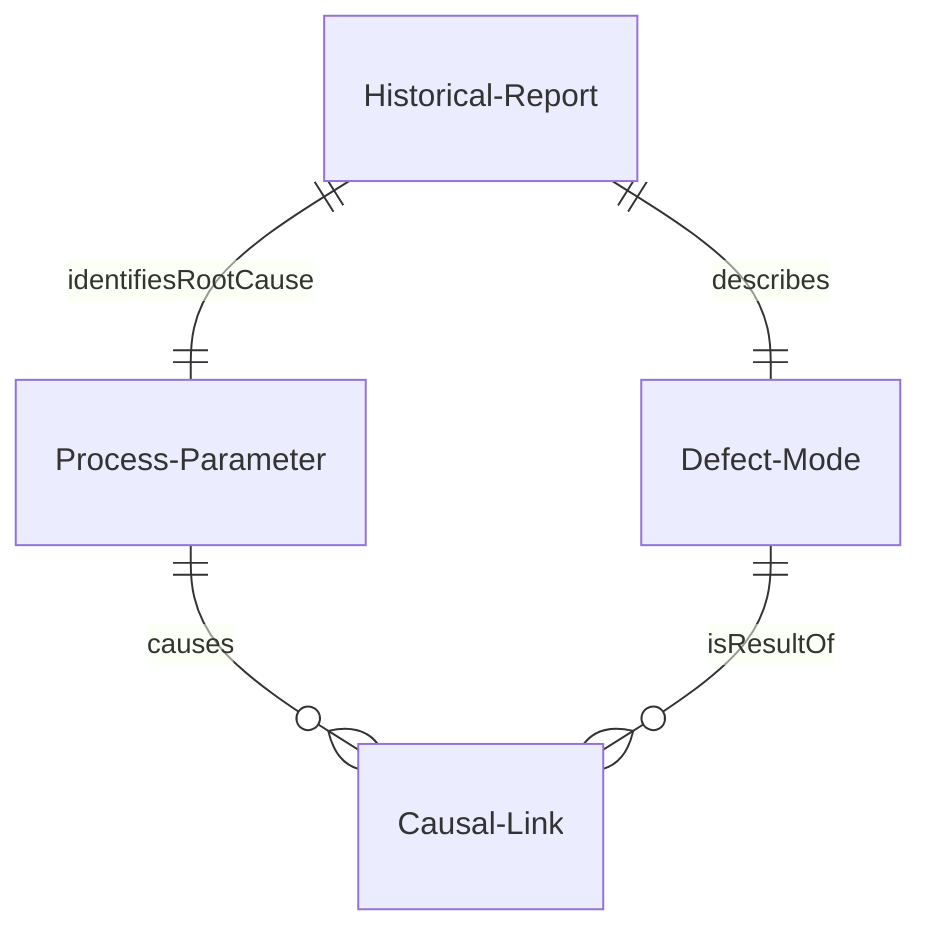
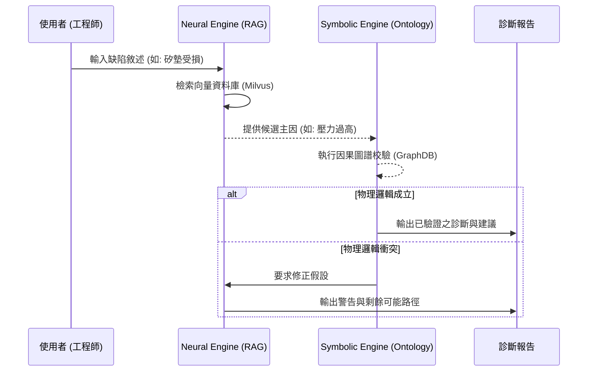

# 半導體 RCA 智慧化系統技術規格文件 (Spec.md)

## 1. 系統架構與選型
本系統採用 **Neuro-symbolic 混合架構**，將大型語言模型 (Neural) 的生成能力與本體論 (Symbolic) 的邏輯嚴謹性結合。

- **Frontend**: Vanilla JS + CSS (Praxie-inspired Professional Light UI)
- **Visualization**: GraphRAG Galaxy-style Causal Network SVG
- **Backend API Interface**: Node.js
- **Symbolic Layer**: RDF/Turtle + Causal Ontology
- **Neural Layer**: Vector Search Retrieval + LLM (Context Injection)
- **Quality Standard**: ISO 8D Automated Reporting

## 2. 資料模型 (ERD 邏輯)

## 3. 關鍵流程 (序列圖)

## 4. 模組關係圖 (Module Relationship)
- `Ontology Module`: 定義製程公理 (TTL)。
- `Experience Module`: 管理歷史維修紀錄 (JSON/Vector)。
- `Reasoning Engine`: 核心推論邏輯，執行 Cross-check。

## 5. 虛擬碼實作邏輯
1. `Neural_Search`: `similarity_score(input, history)`
2. `Symbolic_Check`: `exists(Path(RootCause, Defect, OntologyGraph))`
3. `Final_Verification`: `Logic(Neural_Result && Symbolic_Result)`
